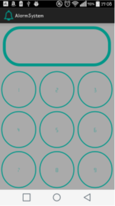

# U10b - Alarm

## Downloads

- [Download des Starterpakets](https://github.com/Android-Regensburg/U10b-Alarm/archive/master.zip)
- [Download des Lösungsvorschlag](https://github.com/Android-Regensburg/U10b-Alarm/archive/solution.zip)

## Aufgabe

Mithilfe der eingebauten Sensoren im Smartphone soll eine Alarmanlage entwickelt werden, die sie durch die Eingabe eines vierstelligen Codes aktivieren können. Ausgelöst wird der Alarm, wenn das Smartphone aufgeboben wird. Anschließend können sie den Alarm wieder ausschalten. Implementieren sie einen Countdown, um die Möglichkeit zu haben das Smartphone hinlegen zu können bevor der Alarm startet.

## Hinweise

* In jedem Smartphone sind verschiedenste Arten von Sensoren verbaut. Für dieses Beispiel kann das Accelerometer verwendet werden, das Beschleunigungen in m/s2 in alle Richtungen misst. Eine kurze Einführung in das Thema und einen Überblick über die Funktionalität der verschiedenen Sensoren findet man hier: http://developer.android.com/guide/topics/sensors/sensors_overview.html

* Für das Abspielen von Tönen und Musik kann die Klasse MediaPlayer verwendet werden. Durch die Methode create kann ein neues Objekt aus einer Ressource erstellt werden. Audiodateien werden im raw-Ordner abgelegt.

* Für ein verzögertes Leeren des Eingabefeldes wird ein bekannter Handler benötigt.

* Für Countdowns stellt Android bereits die Klasse CountDownTimer zur Verfügung.

* Tutorial für die Anpassungen am UI um z.B. abgerundete Ecken zu erzeugen: http://www.mindfiresolutions.com/Howto-create-a-rounded-cornered-view–via-xml–for-Android–1395.php 

## Vorgehen

### Anleitung

#### Änderungen in AlarmSystem

1. Zuerst sollen im Konstruktor die übergebenen Parameter in die dafür vorgesehenen Member abgespeichert und anschließend init() aufgerufen werden. Dort holen sie sich nun einen neuen SensorManager, über den der Sensor für das Accelerometer angesprochen werden kann.

2. In den Methoden start und stop können sie den Listener am Manager an- bzw. abmelden.

3. Letztendlich soll in hasBeenMoved überprüft werden, ob das Telefon bewegt wurde. Dazu können sie aus den übergebenen Parametern den Wert der z-Achse überprüfen. Um als Bewegung erkannt zu werden, muss der Wert mindestens den in MOTION_DETECTION_Z festgelegten Schwellwert erreichen.

#### Anpassungen in der Activity

1. Erstellen sie zunächst in initAlarm ein neues Objekt unserer Alarmanlage.

2. Implementieren Sie handleButtonCLick. Überprüfen sie dazu in welchem Modus sich die App gerade befindet (Alam spielt oder spielt nicht). Als Erstes wird in beiden Fällen ein String erzeugt, der aus Benutzereingaben besteht. Dafür wird setNewInput verwendet. Wenn der Alarm nicht aktiv ist, wird geprüft ob der eingegebene String lang genug ist. Anschließend wird der Start des Alarms initiiert, das Passwort gespeichert und der Userinput zurückgesetzt. Für alle diese Aktionen finden sie bereits die zu Verfügung gestellten Methoden, die sie in den nächsten Schritten vervollständigen.

3. Zum Einschalten des Alarms:

    i. Hier soll zuerst über setNewInput der Wert des geklickten Buttons in das Ausgabefeld geschrieben werden.

    ii. Falls das Passwort die gewünschte Länge an Zeichen erreicht hat, soll der Countdown gestartet werden. IsRunning wird auf True gesetzt. Dann muss in der Methode showCountdown ein neuer CountDownTimer erstellt werden, der im Abstand von 1 Sekunde herunterzählt. Dieses Interface implementiert nun die beiden Methoden onTick und onFinish. Bei jedem Tick soll ein Countdown Toast mit der verbleibenden Zeit in Sekunden angezeigt werden. Stellen sie nach Ablauf der Zeit die Alarmanlage über setPhoneOnAlarm scharf.

    iii. Falls das Passwort die gewünschte Länge an Zeichen erreicht hat, soll der Countdown gestartet werden. IsRunning wird auf True gesetzt. Dann muss in der Methode showCountdown ein neuer CountDownTimer erstellt werden, der im Abstand von 1 Sekunde herunterzählt. Dieses Interface implementiert nun die beiden Methoden onTick und onFinish. Bei jedem Tick soll ein Countdown Toast mit der verbleibenden Zeit in Sekunden angezeigt werden. Stellen sie nach Ablauf der Zeit die Alarmanlage über setPhoneOnAlarm scharf.

4. Durch das Einschalten des Alarms wurde nun der Listener für den Sensor gesetzt, sodass onSensorChanged und onAccuracyChanged mit Werten versorgt werden. Für diese Aufgabe wird nur onSensorChanged benötigt. In dieser Methode stellen sie mithilfe des AlarmSystems fest, ob das Telefon bewegt wird. Gegebenenfalls wird durch startAlarm der Alarmton gestartet und durch setPhoneOnAlarm die Alarmanlage wieder ausgeschaltet.

    i. In startAlarm wird ein MediaObject erstellt, mit der richtigen Mediadatei gefüttert und gestartet. Stellen sie den Mediaplayer auf loop.

    ii. In stopAlarm wird der Media Player gestoppt und auf „reset“ gestellt. (IsRunning = false)

    iii. saveInput soll das neue Passwort speichern.

    iv. clearPassword setzt das aktuelle Passwort zurück.

    v. isCorrectPassword überprüft die Passworteingabe.

#### Änderungen am User Interface

1. Um den Effekt von runden Buttons zu erhalten, soll nun die background_button.xml ergänzt werden.

    i. Zuerst muss im <shape>-Element das Attribut android:shape mit dem Wert oval ergänzt werden.

    ii. Anschließend werden im <shape>-Element drei weitere Elemente angelegt: <solid>, <stroke> und <padding>.

    iii. <solid> beschreibt den Hintergrund des Kreises. Dessen Farbe soll auf schwarz gesetzt werden. (android:color/…)

    iv. <stroke> beschreibt die Ränder des Kreises. Für diesen müssen eine Dicke (width) und eine Farbe gesetzt werden. Die zugehörige Farbe ist in colors.xml hinterlegt.

    v. Im <padding> wird letztendlich noch ein passender Innenabstand (padding) gesetzt, z.B. 6 dp. 

2. Um auch das Eingabefeld an das Styling anzupassen, muss nur noch background_input.xml angepasst werden. Dabei wird analog zum Kreislayout vorgegangen. Ziel ist dieses Mal ein Rechteck mit abgerundeten Ecken:

    i. Deswegen wird hier als android:shape-Wert rectangle eingetragen.

    ii. Neben den bereits bekannten Tags <solid>, <stroke> und <padding>, wird für den Effekt der runden Ecken <corners> benötigt.

    iii. In <corners> können sie durch das Attribut android:radius einstellen, wie stark die Ecken abgerundet werden.

    iv. Alle anderen Werte werden genau wie beim Kreislayout gesetzt, um das gleiche Aussehen zu erreichen.

3. Zum Schluss soll noch die Schriftart für die Tastatur angepasst werden. Die Schriftdatei (im Format .ttf) ist im assets-Ordner hinterlegt. Durch createFromAsset kann ein Typeface erstellt werden. Nun können sie die Schriftart auf alle Buttons anwenden.

## Anhang
### Screenshots

